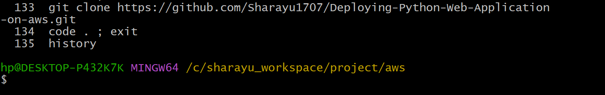
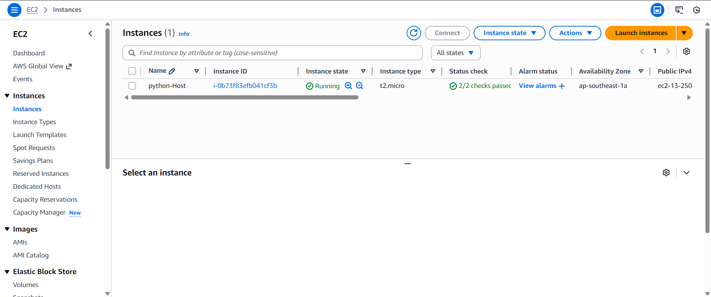
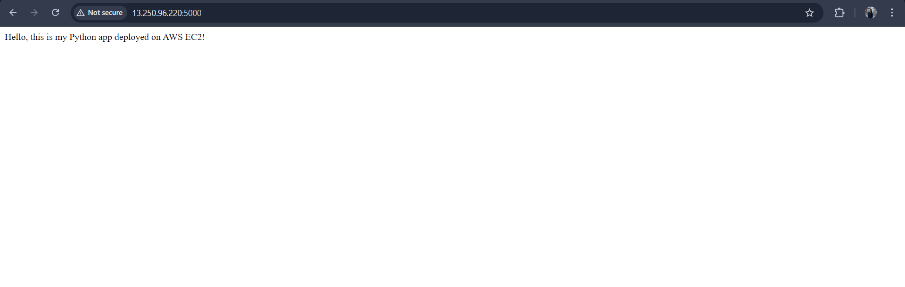

# Deploying-Python-Web-Application-on-aws

## Project Overview

This project demonstrates how to deploy a simple Python Flask web application on an AWS EC2 Ubuntu server without using Nginx.
The app runs directly using Gunicorn on port 5000, making it simple and beginner-friendly.

## Tech Stack

Python 3

Flask

Gunicorn

Ubuntu Server (EC2)

Git

## Project Structure

├── app.py

├── requirements.txt

└── README.md

### Step 1. Clone the Repository

### Step 2. Launch Server

### Step 3. Create Virtual Environment

### Step 4. Install Dependencies

pip install -r requirements.txt

### Step 5. Run the Application (Development Mode)

python app.py

App will run at:

http://13.250.96.220:5000

### Step 6. Run the Application using Gunicorn (Production Mode)

venv/bin/gunicorn --bind 0.0.0.0:5000 app:app

Keep the app running in foreground or use tmux/screen if needed.

### Step 7. Test the Deployment

Open in browser:

http://13.250.96.220:5000

If you see the Flask message → deployment successful ✔

## Features

Simple & lightweight deployment

Direct Gunicorn serving (no Nginx)

Works on any Ubuntu server

Uses virtual environment to manage Python packages

Includes optional systemd auto-start

## Conclusion

This project demonstrates how to deploy a Python web application on AWS EC2 with minimal configuration.

